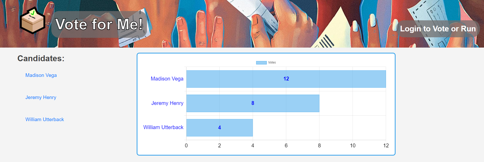

# Elections

## Table of Contents
- [Description](#description)
- [Packages](#packages)
- [Usage](#usage)
- [Screenshots](#Screenshots)
- [Credits](#Credits)
- [Contributors](#Contributors)
- [License](#license)

## Description

Elections is a full stack web application used to gather people's choices and display them. Users can create an account and make 1 candidate profile per account. The candidates and data standings can be viewed from the homepage without logging in. For a user to submit their choice, they must log in or create a profile. Any candidate in the running can withdraw their profile at any time. 

This application uses MVC(Model, Views and Controllers) architecture to follow industry standard framework for making full stack web applications. It incorporates CRUD (Create, Read, Update and Delete) functionality of the models to manipulate the data. The application uses handlebars.js for layout and template organization of the webpage and displaying different routes. The data is hosted using MySQL and uses sequelize to handle the database information. The data is displayed using chart.js which is a javascipt library that is helful in creating chart displays for showing data. The application is deployed through heroku and can be used online via direcy link below. The user can also download the repo, use environment variables and run a local instance of the application if they choose to as well. 

## Packages

- bcrypt
- chartjs
- connect-session-sequelize
- dotenv
- express
- express-handlebars
- express-sessions
- mysql2
- sequelize
- eslint
- prettier
- dotenv

## Usage
The application can be used in a browswer directly from Heroku or locally on their computer.
- [Heroku](#browser)
- [Locally](#locally)

## Browser

You can use the application in your browser through Heroku here: [Elections](https://election-pro.herokuapp.com/)

## Locally

Clone the repo

```
git clone https://github.com/danieltran2016/Elections
```

Install all the required packages in the package.json:

```
npm i
```

Create a `.env` file in the root directory with login credentials:

```
DB_NAME='elections_db'
DB_USER='root'
DB_PASSWORD=''
SESSION_SECRET=''
```

Start the application:

```
npm start
```

Open your web browser and use the URL:
```
 `http://localhost:3001/`.
```

## Screenshots



## Credits
We would like to credit our instructor, Jeremy. Our two TA's, Will and Madison. Their help and guidance was momentous in developing the skills we needed to make a full stack web application. Thie help along with notes and examples provided a strong framework for the project. 


## Contributors
- [Xueyin Bai](https://github.com/xybai0103)
- [William Combee](https://github.com/Willyum863)
- [Daniel Tran](https://github.com/danieltran2016)

## License

[MIT License](https://opensource.org/licenses/MIT).